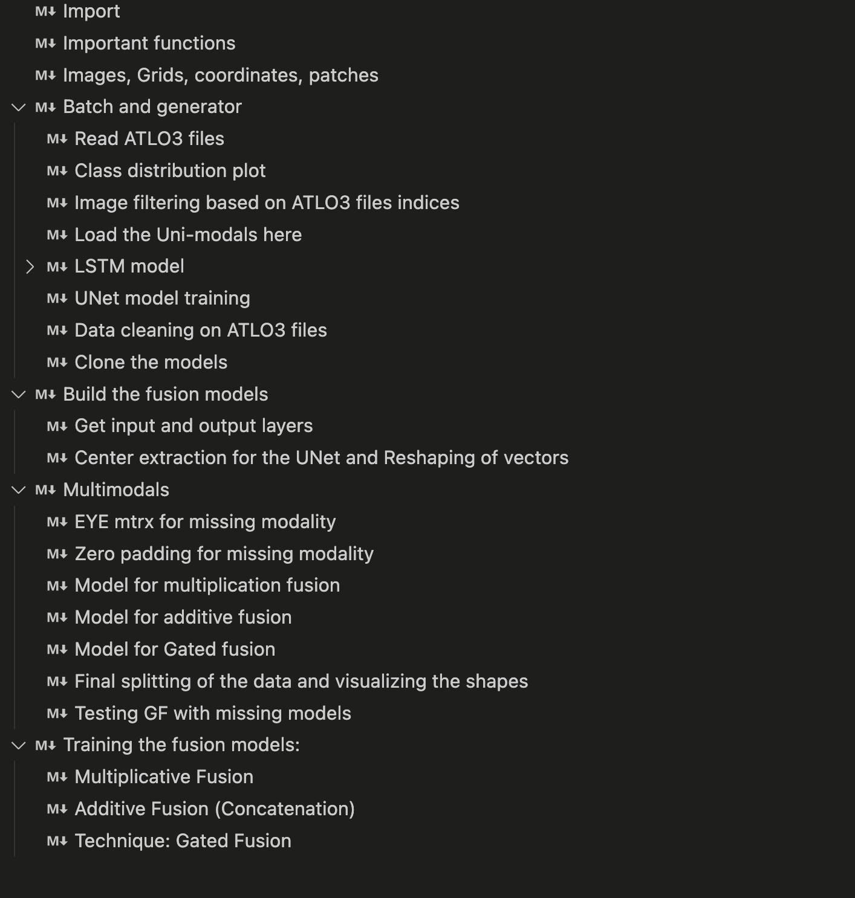

# Multimodal Learning For Sea Ice Classification

This project focuses on multimodal learning using [Sentinel-2](https://www.esa.int/Applications/Observing_the_Earth/Copernicus/Sentinel-2) and [ICESat-2](https://icesat-2.gsfc.nasa.gov/) datasets and machine learning models, including LSTM and [U-Net](https://github.com/jmiqra/S2_Parallel_Workflow). The goal is to process and analyze satellite imagery and related data for various applications.

## Project Structure

``` bash
mm-transformer-model/
├── S2_tif/
├── grid_images/ # Resized images
├── csv/ # CSV files (ATLO3 data)
├── clean/
├── src/
│   ├── MMDL.ipynb
│   ├── converter.py
│   └── util.py
├── .gitignore
├── LICENSE
├── README.md
└── requirements.txt
```

## Setup

1. Clone the repository:

    ```sh
    git clone https://github.com/nathan-g1/mm-transformer-model.git
    cd mm-transformer-model
    ```

2. Create and activate a virtual environment ([conda](https://docs.conda.io/projects/conda/en/latest/user-guide/install/index.html) recommended)

    ```sh
    conda create --name <env_name> python=3.10.15
    conda activate <env_name>
    ```

3. Install the required dependencies:

    ```sh
    pip install -r requirements.txt
    ```

## Usage

The following image shows the contents of `MMDL.ipynb` notebook:



### Data Preparation

- Make sure to download the Sentinel-2 and ICESat-2 datasets and place them in the `S2_tif` and `csv` directories, respectively.
- The data preparation scripts are located in the `src` directory. The Notebook `MMDL.ipynb` contains the section ```Batch and generator``` to handle data preprocessing and feature engineering.

### Training Models

- The `src/MMDL.ipynb` notebook contains code for training multimodal models using three techniques.
- Each steps for preparing and training the models is detailed in sections of the notebook.

### Utilities

- Utility functions are available in `src/util.py` for tasks such as renaming rows in CSV files and reading file names from directories.

## Contributing

1. Fork the repository.
2. Create a new branch (`git checkout -b feature-branch`).
3. Commit your changes (`git commit -m 'Add new feature'`).
4. Push to the branch (`git push origin feature-branch`).
5. Create a new Pull Request.

## License

This project is licensed under the MIT License.
